# CAIXA-DE-FERRAMENTAS-DEVOPS (MINHAS ANOTAÇÕES)
Com essas anotações pretendo praticar e aprender sobre as ferramentas mais utilizadas 
pelos DEVOPS. 

## INSTALANDO O GIT. 
Eu já tenho uma conta no git, segue lá **M41R40**
Eu utilizo o ubuntu, então usei o comando no terminal na minha area de trabalho:


```bash
sudo apt-get install git-core
```


Depois configurei o nome de usuario e o email com os comandos:


```bash
git config --global user.name "usuario"
git config --global user.email "emaildogit"
```

Eu já tinha um repositorio no git para este curso, mas se quiser criar no seu desktop umas pasta unica, use o comando:


```bash
mkdir DEVOPS
```

Para subir os arquivos para o git, você precisa localizar nas configurações do git as SSH-keys, adicionar lá e gerar um par de chaves na sua máquina no diretório ~/.ssh  caso ainda não tenha crie com o comando:


```bash
ssh-keygen
```
- adicione o nome do sistema operacional ao qual usa, caso voce tenha varios, vai conseguir se localizar com mais facilidade, clique enter para as outras informações, deixando em branco. 

Depois leia a chave, copie todo o texto e cole lá no aonde o git solicita a nova SSH-Key.


```bash
cat ~/.ssh nomedasuachave.pub
```

É importante lembrar que se sua pasta é nova, voce deve inicializar o git nela com o comando:


```bash
git init
```

Agora adicione a pasta ao git com o comando:


```bash
git add nomedoarquivo/pasta
```

Comite o arquivo para deixar registrado no historico de versões com o comando:


```bash
git commit -m "a mensagem que quiser"
```

Agora para subir o arquivo use o comando:


```bash
git push -u origin
```

Eu precisei de um comando a mais:

```bash
git pull
```

Qualquer duvida use este comando milagroso:

> ele vai orientar como esta o arquivo, e quais são os próximos passos.


```bash
git status
```

Atualize sua pagina no git, dentro do repositorio e terá novos arquivos:

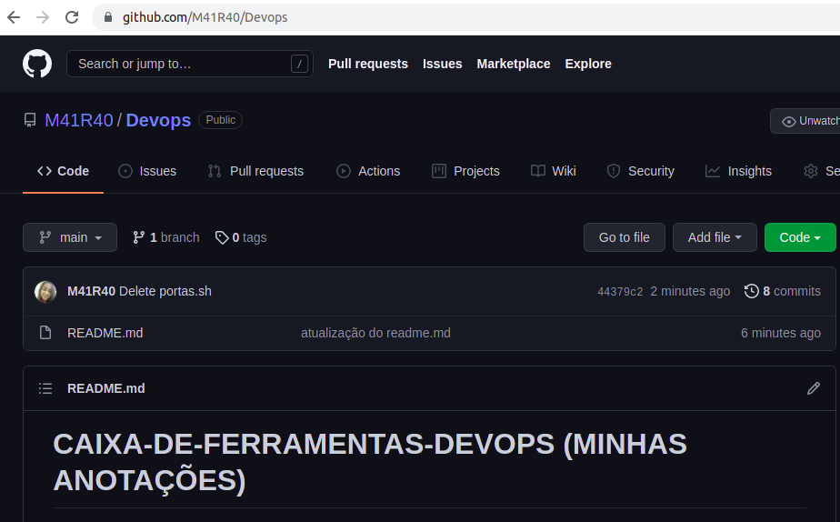

## INSTALANDO O VIRTUAL BOX

Para executar os ambientes que criaremos com o vagrant, precisamos de um aplicativo, a minha escolha será o VirtualBox, mas existem outros, fica a seu critério. Ele é OpeSource :heart_eyes:


Você consegue baixar o VirtualBox de acordo com seu sistema operacional em :

```html
https://www.virtualbox.org/
```

Você vai precisar tambem de uma extensão.

Esta disponivel no link:

```html
https://download.virtualbox.org/virtualbox/6.1.30/Oracle_VM_VirtualBox_Extension_Pack-6.1.30.vbox-extpack
```

Eu precisei atualizar meu sistema operacional com os comandos, para o Virtual Box iniciar:

```bash
sudo apt update
sudo apt upgrade
```

Olha que gracinha a interface do VirtualBox. :satisfied:

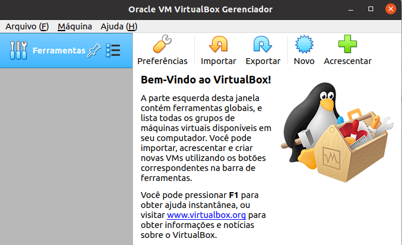

### INSTALANDO UMA ISO DO UBUNTU. 

Uma ISO, é uma imagem de um sistema operacional pronto, facil de instalar, nesta vamos instalar o ubuntu, disponivel no site deles em:

```html
https://releases.ubuntu.com/18.04.6/ubuntu-18.04.6-live-server-amd64.iso?_ga=2.202179031.718787446.1639687321-193693467.1639687321
```

Lá no virtual box, você vai clicar em novo;

- colocar o nome ubuntu;
- escolher tipo linux;
- versão ubuntu 64 bits;
- clique em próximo;
- tamanho 1024 mesmo;
- clique em próximo;
- vai criar um disco rígido virtual agora;
- clique em criar;
- escolha VMDK;
- escolha dinamicamente alocado e próximo;
- 10,00 GB tá bom, clique em criar. 

### Adicionando a ISO do ubuntu.

- dois cliques em cima da máquina nova;
- aparecerá uma caixa para selecionar a imagem iso baixada;
- configure a máquina conforme sua necessidade e com seu nome. 

OBS: É muito trabalhoso na minha humilde opinião, mas é ótimo para o aprendizado. 


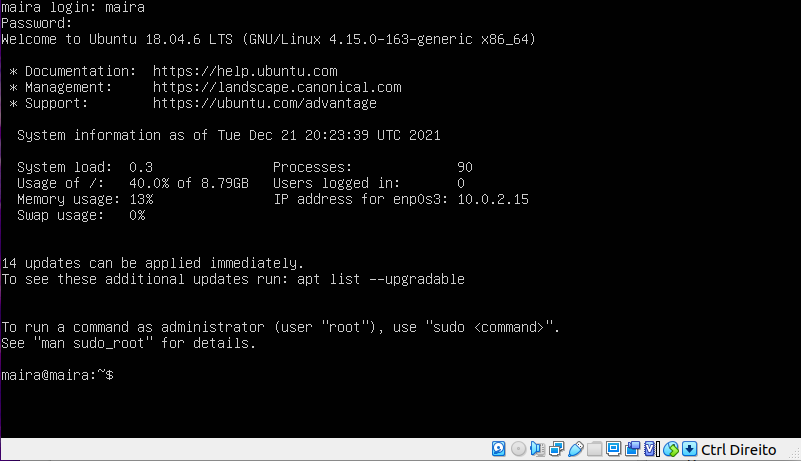


## INSTALANDO O VAGRANT


Para ter um ambiente de produção precisamos desta ferramenta, conciliada a um aplicativo de virtualização de máquinas como o VirtualBox ou VMWare, o Vagrant é uma ferramenta de provisionamento de maquinas virtuais, ela cria uma imagem de um disco em uma pasta, com descrição de processador, memória, discos e conexões. 

Faça download do vagrant no site:

```html
https://www.vagrantup.com/downloads
```

Faça download conforme seu sistema operacional, ou se já utilizar um linux, siga estes comandos em seu terminal conforme é orientado no site deles:

```bash
curl -fsSL https://apt.releases.hashicorp.com/gpg | sudo apt-key add -

sudo apt-add-repository "deb [arch=amd64] https://apt.releases.hashicorp.com $(lsb_release -cs) main"

sudo apt-get update && sudo apt-get install vagrant

```

### Iniciando uma máquina ubuntu com o vagrant

Crie uma pasta com o comando:

```bash
mkdir testevm
```

Dentro da pasta, crie um arquivo chamado *vagrantfile*

```bash
nano Vagrantfile
```

E neste arquivo cole esse texto:
> é interessante se atentar a tabulação das linhas e lembrar de salvar o arquivo.

```ruby
# -*- mode: ruby -*-
# vi: set ft=ruby :
# essas linhas acima indicam a linguagem para o editor de texto

VAGRANTFILE_API_VERSION = "2" # versão da API do Vagrant

# Este bloco de ruby contém todas as atividades que o Vagrant
# deve executar representadas pelo objeto que chamei de config
Vagrant.configure(VAGRANTFILE_API_VERSION) do |config|
# config.vm cria um objeto que descreve uma máquina virtual.
# Chamei esta vm de "testevm" e quero utilizar o Ubuntu Trusty
# Indiquei que quero um IP publico para esta máquina
	config.vm.define "testvm" do |testvm|
		testvm.vm.box = "ubuntu/trusty64"
		testvm.vm.network :public_network, ip: "192.168.0.190"
	end
	
# Este bloco me dá acesso ao provedor da máquina virtual
# (VirtualBox)
# Configurei esta máquina com 1GB de memória
	config.vm.provider "virtualbox" do |v|
		v.customize ["modifyvm", :id, "--memory", "1024"]
		end
	end
```

Dentro da pasta, agora inicie esta máquina com o comando:
> o virtualbox deve estar aberto.

```bash
vagrant up
```
Vai lá no seu virtualbox agora, vai ter uma máquina nova em execução com o nome da pasta que foi criada:

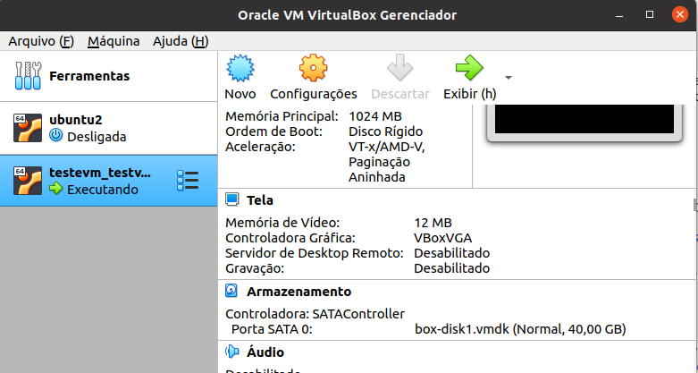


Agora se conecte a esta máquina com o comando:

```bash
vagrant ssh
```
Foi mais rápido criar um ubuntu pelo vagrant ne ?!  :heart_eyes:


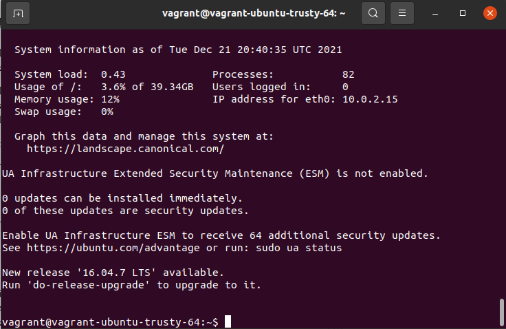


Para destruir a máquina utilize o comando:

```bash
vagrant destroy
```

Caso queira apenas encerrar sua sessão:

```bash
vagrant halt
```
 
### Atualizando a máquina ubuntu e criando um servidor Web.

Continuemos, agora vamos atualizar a máquina criada.
> Certifique de que esta conectado a máquina com o vagrant ssh.

```bash
sudo apt-get update
sudo apt-get install nginx
```
Abra no terminal local agora o ip que setou no arquivo de configuração do vagrant. :relieved:

```html
http://192.168.0.190
```
:heart:

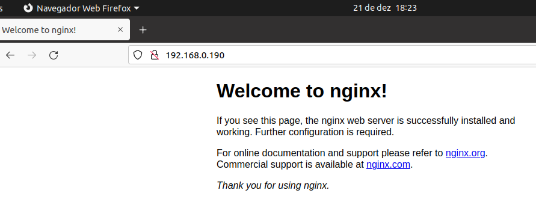


No terminal digite os comandos:

```bash
sudo -s 
echo "boa maira" > /usr/share/nginx/html/index.html
```
Agora atualize seu navegador na página do nginx.

:boom:

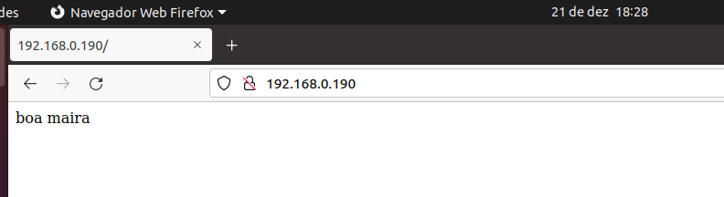

### Criando um arquivo de atualização e instalação do NGINX.

Dentro da pasta **testvm** crie o arquivo em shell **webserver.sh** para atualização e instalação do NGINX, assim que rodar o vagrantfile. 

```bash 
nano webserver.sh
```

Adicione este código ao arquivo.

```shell
#!/bin/bash
echo "Atualizando repositórios"
sudo apt-get update
echo "Instalando o nginx"
sudo apt-get -y install nginx
```

Depois de salvar o arquivo, edite o **Vagrantfile** com o comando:

```bash
nano Vagrantfile 
```
Adicione a linha **testevm.vm.provision "shell", path: "webserver.sh"** para o vagrant rodar o arquivo de shell script, 

```ruby
# -*- mode: ruby -*-
# vi: set ft=ruby :

VAGRANTFILE_API_VERSION = "2" 

Vagrant.configure(VAGRANTFILE_API_VERSION) do |config|

	config.vm.define "testvm" do |testvm|
		testvm.vm.box = "ubuntu/trusty64"
		testvm.vm.network :public_network, ip: "192.168.0.190"
		testevm.vm.provision "shell", path: "webserver.sh"
	end
	
	config.vm.provider "virtualbox" do |v|
		v.customize ["modifyvm", :id, "--memory", "1024"]
		end
	end
```

Salve todos os arquivos, depois utilize os comandos respectivamente para destruir e para criar novamente a máquina:

```bash
vagrant destroy
vagrant up
```

> note que dessa vez não precisará se conectar com vagrant ssh, é só atulizar seu navegador que irá notar a instalação automatica do nginx. 

### Instalando o PHP5.

Agora vamos modificar o arquivo **webserver.sh** para que ele instale o PHP5 na máquina, logo na inicialização do vagrant, então adicione a linha ao final do script : **sudo apt-get install -y php5-fpm** e os pacotes necessarios.


```shell
#!/bin/bash

echo "Atualizando repositórios"
sudo apt-get update
echo "Instalando o nginx"
sudo apt-get install nginx -y
echo "Instalando o PHP5"
sudo apt-get install php5-fpm  -y
```

O diferencial desta vez é que não vamos destruir a máquinas vamos utilizar um comando novo para executar o provisionamento *vagrant provision*

Siga os seguintes comandos em seu terminal local, dentro da pasta **testvm** :

```bash
vagrant halt  #encerra sessão
vagrant up   #inicia sessão
vagrant provision  # provisiona as mudanças realizadas
```

## Instalando o ANSIBLE.


O ansible é  feito em python e funciona em muitas plataformas, é uma ferramenta local para seu servidor de dados, se comunica com as máquinas virtuais por meio de SSH, possui bibliotecas completas, que fornecem módulos paara provisionamento de máquinas e aplicações remotamente, provisionar é instalar e configurar itens de infraestrutura em máquinas e banco de dados por exemplo. 

Localmente, se estiver usando o ubuntu como eu, siga estes comandos para a instalação do ansible:

```bash
sudo apt-get install software-properties-common
sudo apt-add-repository ppa:ansible/ansible
sudo apt-get update
sudo apt-get install ansible
```

Para testar a instalação, use o comando:
> deve aparecer a ajuda do ansible.

```bash
ansible-playbook -h
```

Dessa forma:

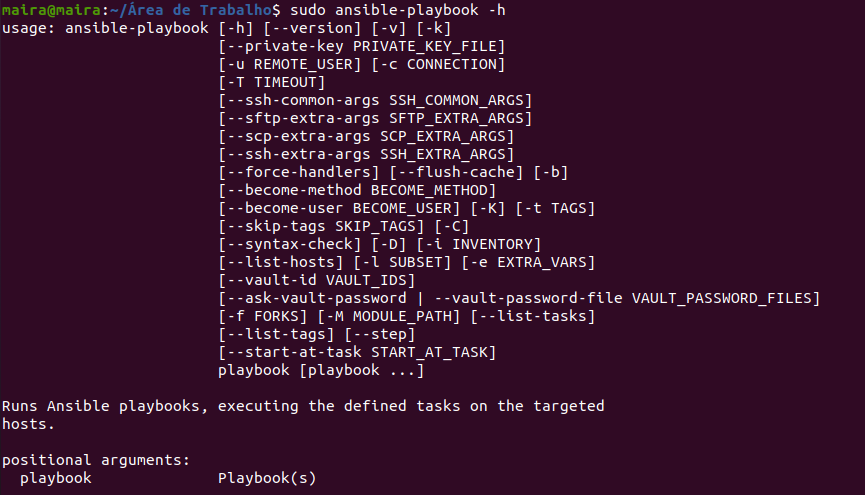


### Instalando o nginx com o ansible no formato YAML. 


**YAML** é um formato que serve para serialização e transmissão de
dados. Ele é composto de palavras-chaves separadas de um valor
por : (dois pontos). 
Seus dados podem ser chaves e valores, listas
de chaves e valores e dicionários.

Neste capítulo vamos criar um novo arquivo dentro da pasta testvm, chamado **webserver.yml**:

```bash
nano webserver.yml
```
Dentro do arquivo adicione o código:

> se atente aos espaçoes e ao sinal de dois pontos (:).

```yaml  
- hosts: all
  become: true
  user: vagrant
  tasks:
    - name: "Atualiza pacotes"
      shell: sudo apt-get update

    - name: "Instala o nginx"
      shell: sudo apt-get -y install nginx
```

### Modificando o Vangrantfile para que identifique o arquivo webserver.yml.


Dentro da pasta testvm, edite o arquivo **Vangrantfile** para que ele leia o arquivo **yml** em sua inicialização com o comando:

```bash
nano Vangrantfile
```

Adicione após o **ip** e antes do **config.vm.provider** o seguinte código:

```bash 
	testvm.vm.provision "ansible" do |ansible|
		ansible.playbook = "webserver.yml"
		ansible.verbose = "vvv"
	end
end
```

O código completo é:

```ruby
# -*- mode: ruby -*-
# vi: set ft=ruby :

VAGRANTFILE_API_VERSION = "2"

Vagrant.configure(VAGRANTFILE_API_VERSION) do |config|

  config.vm.define "testvm" do |testvm|
    testvm.vm.box = "ubuntu/trusty64"
    testvm.vm.network :private_network, ip: "192.168.33.21"
    
    testvm.vm.provision "ansible" do |ansible|
          ansible.playbook = "webserver1.yml"
	  ansible.verbose = "vvv"
    end

  end

  config.vm.provider "virtualbox" do |v|
    v.customize ["modifyvm", :id, "--memory", "1024"]
  end

end
```

Agora suba a máquina testvm, novamente, dentro da pasta testvm com o comando:

```bash
vagrant up
```

Se você não destruiu a máquina no capítulo anterior pode ter problemas, então use o comando **vagrant destroy**.

Depois de subir a máquina se você tiver uma saída semelhante a esta, esta tudo ok com a instalação.

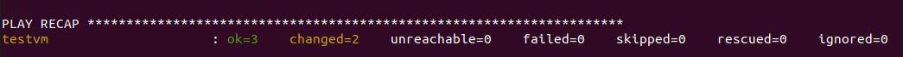


## Instalando um servidor completo. 

### PHP


Montaremos um playbook que instale e configure um WordPress completo, com o nginx como servidor, o PHP e o Mysql. 

Crie uma nova pasta, nomeada **blogvm** com o comando:

```bash
mkdir blogvm
```

Crie dentro da pasta um arquivo nomeado **Vangrantfile** com o comando:

```bash 
sudo nano Vangrantfile
```
Adicione o código a seguir em seu arquivo, ele terá previamente configurações ansible, para o arquivo que criaremos depois, não esqueça de salvar antes de fechar o arquivo.

```ruby
# -*- mode: ruby -*-
# vi: set ft=ruby :

VAGRANTFILE_API_VERSION = "2"

Vagrant.configure(VAGRANTFILE_API_VERSION) do |config|

  config.vm.define "blogvm" do |blogvm|
    blogvm.vm.box = "ubuntu/trusty64"
    blogvm.vm.network :public_network, ip: "192.168.55.3"

    blogvm.vm.provision "ansible" do |ansible|
      ansible.playbook = "blog.yml"
      ansible.verbose = "vvv"
    end

  end

  config.vm.provider "virtualbox" do |v|
    v.customize ["modifyvm", :id, "--memory", "1024"]
  end

end
```

Crie no mesmo diretório, um arquivo nomeado **blog.yml** com o comando:

```bash 
sudo nano blog.yml
```

Adicione por enquanto neste arquivo o seguinte código:

```yaml
<?php phpinfo(); ?>

- hosts: all
  become: true
  user: vagrant
  tasks:
    - name: "Atualiza pacotes e instala nginx"
      apt: name=nginx state=latest update_cache=yes install_recommends=yes

    - name: "Instala PHP-FPM"
      apt: name=php5-fpm state=latest install_recommends=yes

    - name: "Instala MySQL"
      apt: name=mysql-server state=latest install_recommends=yes

    - name: "Cria diretório /opt/wordpress"
      shell: mkdir -p /opt/wordpress

    - name: "Copia configuração de blog.nginx para
      /etc/nginx/sites-available/blog"
      copy: src=blog.nginx dest=/etc/nginx/sites-available/blog

    - name: "Ativa o site"
      shell: ln -fs /etc/nginx/sites-available/blog /etc/nginx/sites-enabled/blog

    - name: "Apaga o site default"
      shell: rm -f /etc/nginx/sites-enabled/default

    - name: "Reinicia o NGINX"
      shell: service nginx restart

    - name: "Cria uma pagina de teste do PHP"
      copy: src=test.php dest=/opt/wordpress
```

Esses arquivos são finais do capítulo anterior, a melhor maneira de utilizar o php com o nginx é a versão FPM.

Agora crie um arquivo de configuração no nginx para que o site saiba interpretar arquivos com extensão PHP. 


```bash
sudo nano blog.nginx
```

Adicione o código a seguir para configura-lo:

```conf
server {
        listen 80;
        server_name blog localhost;

        access_log /var/log/nginx/blog.access.log;

        root /opt/wordpress;
        index index.html index.htm index.php;

        location / {
                try_files $uri $uri/ /index.html;
        }
        location ~ \.php$ {
                try_files $uri =404;
                fastcgi_pass unix:/var/run/php5-fpm.sock;
                fastcgi_index index.php;
                fastcgi_param SCRIPT_FILENAME
                $document_root$fastcgi_script_name;
                include fastcgi_params;
        }
}

```

O desafio deste capítulo é conseguir visualizar a tela de informações impressas do PHP, no navegador com o ip escolhido, para isso vamos criar um arquivo **test.php** com o comando:

```bash 
sudo nano test.php
```
adicione o código padrão para exibir as informações do php dentro do arquivo:

```php
<?php phpinfo(); ?>

```

Salve o arquivo, e no terminal dentro da pasta **blogvm**, execute o comando para iniciar o vagrant:

```bash 
vagrant up
```

Depois abre seu navegador e digite o ip que setou no vagrantfile, com barra **/test.php** e deve visualizar a pagina do php com algumas informações. 

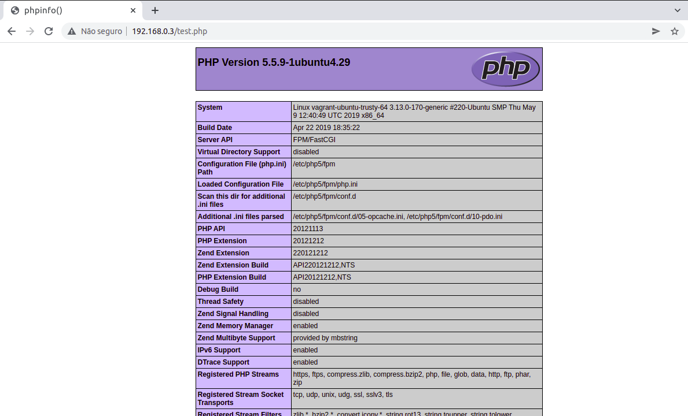
 
 
Até aqui temos somente um página com um interpretador de código funcionando, agora vamos prosseguir a instalação dos dois ultimos serviços. 

Pode destruir a máquina, para que não haja conflito no código que vamos adicionar a seguir ok.

```bash
vagrant halt
vagrant destroy
```

 
### Mysql e Wordpress.

 
Para prosseguir a instalar do Mysql vamos utilizar as extensões para PHP, a biblioteca de python. Deixaremos configurado no arquivo **blog.yml** informações para iniciar o Mysql, para criar o usuario e uma senha, o mesmo para o Wordpress, 
mas vamos corrigir algumas permissões nele antes. Para que não haja acesso ao grupo **www-data**.

Dentro da pasta blogvm, edite o arquivo **blog.yml** com o comando a seguir, para adicionar as informações explicadas anteriormente.


```bash 
sudo nano blog.yml
```

Adicione esse código ao arquivo, excluindo as informações anteriores. 

```yaml
- hosts: all
  become: true
  user: vagrant
  vars:
    mysql_root_password: root
    mysql_wp_user: wordpress
    mysql_wp_password: wordpress
    wordpress_db_name: wordpress

  tasks:
    - name: "Atualiza pacotes e instala nginx"
      apt: name=nginx state=latest update_cache=yes install_recommends=yes

    - name: "Instala PHP-FPM"
      apt: name=php5-fpm state=latest install_recommends=yes

    - name: "Instala MySQL"
      apt: name=mysql-server state=latest install_recommends=yes

    - name: "Instala Extensões de MySQL para PHP"
      apt: name=php5-mysql state=latest install_recommends=yes

    - name: "Instala biblioteca python-mysqldb"
      apt: name=python-mysqldb state=latest install_recommends=yes

    - name: "Copia configuração de blog.nginx para /etc/nginx/sites-available/blog"
      copy: src=blog.nginx dest=/etc/nginx/sites-available/blog

    - name: "Apaga o site default"
      file: path=/etc/nginx/sites-enabled/default state=absent

    - name: "Ativa o site"
      file: src=/etc/nginx/sites-available/blog  dest=/etc/nginx/sites-enabled/blog state=link

    - name: "Reinicia NGINX"
      service: name=nginx state=restarted

    - name: "Cria /opt/wordpress"
      file: dest=/opt/wordpress mode=755 state=directory owner=www-data

    - name: "Download do Wordpress"
      get_url: url=https://wordpress.org/latest.tar.gz  dest=/tmp/latest.tar.gz

    - name: "Abre wordpress em /opt/wordpress"
      unarchive: src=/tmp/latest.tar.gz dest=/opt copy=no

    - name: "Corrige permissões"
      file: path=/opt/wordpress recurse=yes owner=www-data group=www-data

    - name: "Inicia MySQL"
      service: name=mysql state=started enabled=true

    - name: "Cria .my.cnf"
      template: src=my.cnf.j2 dest=~/.my.cnf mode=0600

    - name: "Cria senha de root para root@mysql"
      mysql_user: name=root
              password="{{ mysql_root_password }}"
              check_implicit_admin=yes
              priv="*.*:ALL,GRANT"
              state=present
              host="{{ item }}"
      with_items:
        - "{{ ansible_hostname }}"
        - 127.0.0.1
        - localhost
    - name: "Cria wordpress database"
      mysql_db: name=wordpress
                login_user=root
                login_password="{{ mysql_root_password }}"
                state=present
    - name: "Cria usuário wordpress"
      mysql_user: name="{{ mysql_wp_user }}"
                password="{{ mysql_wp_password}}"
                priv="{{ wordpress_db_name }}".*:ALL
                check_implicit_admin=yes
                login_user=root
                login_password="{{ mysql_root_password }}"
                host="{{ item }}"
                state=present
      with_items:
        - "{{ ansible_hostname }}"
        - 127.0.0.1
        - localhost
```
Há informações novas nesse código, como **vars**, que nada mais é do que variaveis para introduzir de forma prática no estilo template conforme a engine do jinja2. 

Por fim, o comando:

```bash 
vagrant up
```

E paciência, pois vai demorar, um pocão.  :joy:  :joy: :joy: :joy:
 
 
 
## Proxy reverso.

Neste tópico o autor orienta como configurar uma aplicação simples na porta 10000, para obter resposta por meio de uma API de echo, recebendo um POST e imprimindo um valor de volta, agora se o método chamado for GET, outra mensagem aparecerá. 

Crie uma pasta nomeada **python-nginx**:
 
```bash
mkdir python-nginx
```
 
Crie dentro do diretorio **python-nginx** o arquivo **http_server.py**:
 
```bash
nano http_server.py
```

Adicione o código em python a ele:

 
```python
#!/usr/bin/python

import SimpleHTTPServer
import SocketServer
import cgi
import socket

PORT=10000

class ReuseAddrTCPServer(SocketServer.TCPServer):
    def server_bind(self):
        self.socket.setsockopt(socket.SOL_SOCKET, socket.SO_REUSEADDR, 1)
        self.socket.bind(self.server_address)

class ServerHandler(SimpleHTTPServer.SimpleHTTPRequestHandler):
    def do_GET(self):

        self.wfile.write("<html><body><form action='/' method=POST>")
        self.wfile.write("<textarea name=msg rows='10' cols='100'></textarea>")
        self.wfile.write("<br><input type='submit' name='submit'>")
        self.wfile.write("</form></body></html>")
        return

    def do_POST(self):
        self.send_response(200)
        self.end_headers()
        form = cgi.FieldStorage(
            fp=self.rfile,
            headers=self.headers,
            environ={'REQUEST_METHOD':'POST',
                     'CONTENT_TYPE':self.headers['Content-Type'],
                     })

        for field in form.keys():
            self.wfile.write('\t%s=%s\n' % (field, form[field].value))

        return

ReuseAddrTCPServer(("", PORT), ServerHandler).serve_forever()
```

Esse código cria uma servidor HTTP com as bibliotecas padrão de Python, escuta na porta 10000 e só responde a requests HTTP do tipo GET e POST.

Ainda dentro desse diretorio  **python-nginx** crie o arquivo **Vagrantfile**:

```bash
nano Vagrantfile
```

Adicione a ele a seguintes informações:

```ruby
# -*- mode: ruby -*-
# vi: set ft=ruby :

VAGRANTFILE_API_VERSION = "2"

Vagrant.configure(VAGRANTFILE_API_VERSION) do |config|

  config.vm.define "webapp" do |webapp|
    webapp.vm.box = "ubuntu/trusty64"
    webapp.vm.network :public_network, ip: "192.168.56.100"
    
    webapp.vm.provision "ansible" do |ansible|
          ansible.playbook = "web.yml"
	  ansible.verbose = "vvv"
    end

  end

  config.vm.provider "virtualbox" do |v|
    v.customize ["modifyvm", :id, "--memory", "1024"]
  end

end
```

Ainda precisamos de mais um arquivo referente ao provisionamento do Ansible, então dentro do diretorio  **python-nginx**  crie o arquivo **web.yml** com o comando a seguir:

```bash
nano web.yml
```

Adicione a ele as seguintes informações:

```yaml
- hosts: all
  become: true
  user: vagrant
  roles:
    - common
    - nginx
    - app
```

Abra dois terminais agora. 

Na pasta **python-nginx** dê o comando para executar a máquina. 

```bash
vagrant up
```

No outro terminal, execute o arquivo **.py** dentro da pasta  **python-nginx** tambem.

```python
python http_server.py
```
> Instale o python2, com python3 esse codigo não vai funcionar. (pedir correções para o autor :sunglasses: )

```bash
sudo apt install python2
```

Agora no outro terminal execute o comando curl para se comunicar pela porta 10000:

Esse é com o POST
```bash 
curl -X POST -d "msg=Maira&oi=Maravilhosa" http://localhost:10000
```

Mas funciona com o GET tambem:

```bash
curl GET -d "msg=Maira&oi=Maravilhosa" http://localhost:10000
```

Vamos visualizar agora, primeiro os comandos POST e GET que retornaram as mensagens enviadas corretamente:

Este é o print da tela onde o comando curl esta sendo executado. 

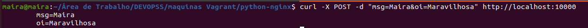


Esse é o print da tela onde o código python esta sendo executado.

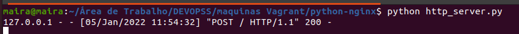


Esse servidor não tem o mínimo necessario para uma boa análise de logs, mas servirá para utilizar a plicação Python e o nginx com proxy reverso.


## Proxy reverso e wordpress em duas máquinas. 

Vamos melhorar o playbook e criar um arquivo com o Vagrant que tem mais de uma máquina, para termos dois wordpress funcionando, o objetivo é que um banco de dados fique em uma e o Wordpress em outra. 

Crie a pasta **blogvm-Wordpress** com o comando:

```bash
mkdir blogvm-Wordpress
```

Dentro dela crie o arquivo Vagrantfile com o comando:

```bash
nano Vagrantfile
```

Adicione ao arquivo o código:

```ruby
# -*- mode: ruby -*-
# vi: set ft=ruby :

VAGRANTFILE_API_VERSION = "2"


Vagrant.configure(VAGRANTFILE_API_VERSION) do |config|

  config.vm.define "web" do |webvm|
    webvm.vm.box = "ubuntu/trusty64"
    webvm.vm.network :public_network, ip: "192.168.56.23"
    
    webvm.vm.provision "ansible" do |ansible|
          ansible.playbook = "blog.yml"
	  ansible.verbose = "vvv"
	  ansible.groups = {
	    "web" => ["192.168.56.23"],
	    "db" =>  ["192.168.56.24"],
          }
	  ansible.limit = "web"
    end
  end
  
  config.vm.define "db" do |dbvm|
    dbvm.vm.box = "ubuntu/trusty64"
    dbvm.vm.network :public_network, ip: "192.168.56.24"
    
    dbvm.vm.provision "ansible" do |ansible|
          ansible.playbook = "blog.yml"
	  ansible.verbose = "vvv"
	  ansible.groups = {
	    "web" => ["192.168.56.23"],
	    "db" =>  ["192.168.56.24"],
	 }
	  ansible.limit = "db"
    end
  end

  config.vm.provider "virtualbox" do |v|
    v.customize ["modifyvm", :id, "--memory", "1024"]
  end

end
```


Agora vamos informar ao **Ansible** as configurações (roles), de cada máquina.

Primeiro crie o arquivo **db.yml** dentro de blogvm-Wordpress com o comando:

```bash
nano bd.yml
```

Adicione o código:

```yaml
- hosts: db
  become: true
  user: vagrant
  vars_files:
    - vars/mysql.yml
  roles:
    - common
    - mysql
```

Segundo crie o arquivo **web.yml** com o comando:

```bash
nano web.yml
```
Adicione o código ao arquivo

```yaml
- hosts: web
  become: true
  user: vagrant
  roles:
    - common
    - php
    - nginx
    - wordpress
```

Atualize o arquivo **blog.yml** para o seguinte código:

```yaml
- hosts: web
  become: True
  user: vagrant
  roles:
    - common
    - php
    - nginx
    - wordpress

- hosts: db
  sudo: True
  user: vagrant
  vars_files:
    - vars/mysql.yml
  roles:
    - common
    - mysql
```


Com esses arquivos já é possivel subir as máquinas.

```bash
vagrant up
```


Vai demorar um pouco. Aguarde !

Depois pode se conectar as máquinas pelo comando:

```bash
vagrant ssh db ou web
```

Mas se abrir o virtual box verá que há duas máquinas com os respectivos nomes criadas em execução.

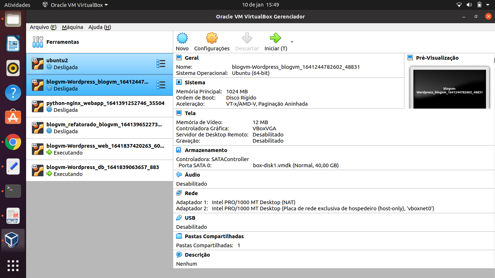
